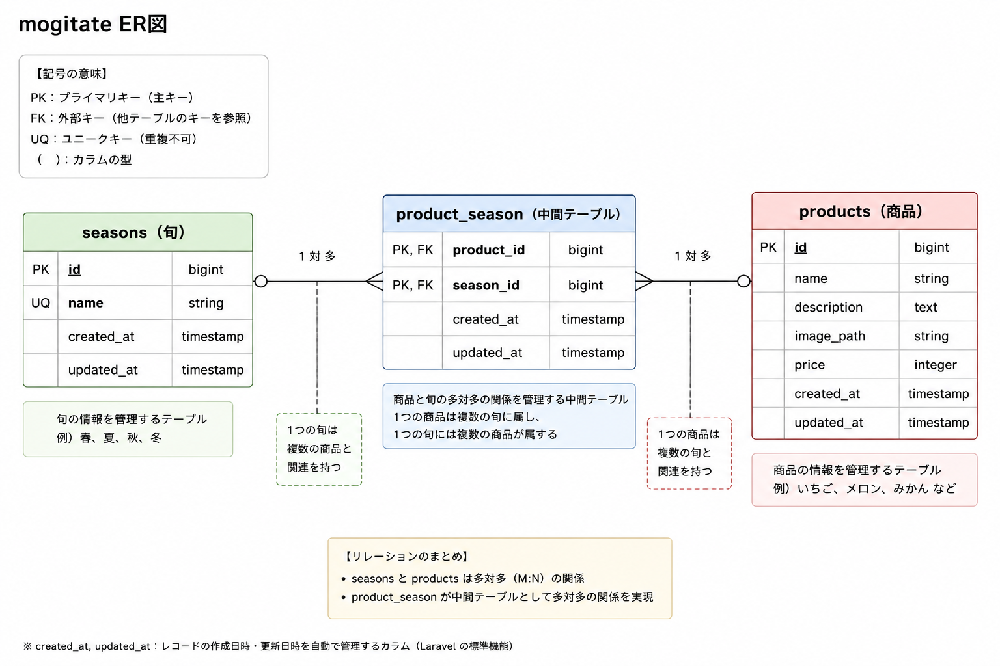

# FashionablyLate

## 環境構築

### Dockerビルド

```bash
git clone https://github.com/to3310ri/FashionablyLate.git
cd FashionablyLate
docker-compose up -d --build
```

### Laravel環境構築

```bash
docker-compose exec php bash

composer install

cp .env.example .env

php artisan key:generate

php artisan migrate --seed
```

---

## 使用技術（実行環境）

- PHP 8.2
- Laravel 10
- MySQL 8.0
- Docker
- phpMyAdmin

---

## ER図



---

## URL

- 開発環境：http://localhost
- phpMyAdmin：http://localhost:8080